## Tutorial Getting Started with the EWPtool

### What is the EWPtool utility?
__EWPtool__ is a lightweight sidekick that can help by speeding up the process of populating an IAR **E**mbedded **W**orkbench **P**roject (`.ewp`) with an existing source code tree.

Currently the IDE allows adding source files from a single folder at a time, which is fine for a few folders. Although, this process can become time-consuming in cases where there are too many folders.

### What does EWPtool do?
From the IDE, the EWPtool utility acts as an external tool that extends its functionality. When invoked, it asks for where the project's source tree can be found. Then EWPtool automates the task of populating the project with the source code tree. The bigger the selected source tree is, the more evident its yielded benefit becomes. 

The __EWPtool__ modifies the following entries in the `.ewp` project:
* Populates the project's tree layout, reflecting the selected source code tree layout in the filesystem.
* Fills the preprocessor search paths entries, for the active _build configuration_.
* Updates moved/renamed entries from the project tree layout.
* Removes stale entries from the project tree layout.

### What does EWPtool not do?
Rest assured that:
* __EWPtool__ does __not__ modify your _source files_.
* __EWPtool__ does __not__ convert existing _project files_ created by 3rd-party IDEs.
>:bulb: About that, some target architectures of the _IAR Embedded Workbench_ might offer _built-in project converter tools_ able to deal with projects from 3rd-party IDEs. The _EWPtool utility_ is __not__ a requirement for when using those tools. In those cases, you can safely disregard this tutorial. Instead, please visit the _Migration Guides_ section in the official [Project Migration tools][url-iar-migration] page for more information specific to those tools.

## Installing
The __EWPtool__ can be used with any reasonably recent versions of the _IAR Embedded Workbench_. Installing the tool simply means deploying its files on top of an existing instance of the IDE. Please follow the steps below:

1. Close all the instances of the IDE.
2. Download the archive with the latest release of the [EWPtool][url-repo-tool-release-dl] utility. [[Release notes][url-repo-tool-release-rn]] 
3. Extract the zip archive contents inside the `<path-to>/<iar-embedded-workbench-installation-folder>/common` folder.
4. Launch the IDE.

>:warning: Please notice that, if multiple instances of the _IAR Embedded Workbench_ are installed on independent locations, __step 3.__ must be repeated for each instance in which the __EWPtool__ is going to be used with.

## Upgrading
For upgrading from previous __EWPtool__ versions, replace the old files in the `common` folder and re-launch the IDE.

## How to use it? 
The project layout in the _IAR Embedded Workbench_ is logical. This means that, whenever desired, source files could be added and grouped in a completely different way than the way they are actually arranged in the filesystem.

The __EWPtool__ populates a project by reflecting the selected source tree layout, so the logical layout will initially match the layout from the filesystem.

### Adding the project's sources
From this section onwards, we will use a fictional project containing many source folders as an example on how the __EWPtool__ can be used.

>:warning: __EWPtool__ does not create any sort of backup of the affected `<project-name>.ewp`. Before proceeding it is recommended to have a _version control system_ in place or __-at least-__ a backup copy of the project, in case you wish to rollback any performed changes.

* Create a __New Empty Project__ by choosing `Project` → `Create New Project` → `Empty Project` → `OK`.

* A __Save As__ dialog will show up. Save the `<project-name>.ewp` in the project's source tree top level folder.

>:bulb: The tool can only act upon the contents it finds on the "disk". To avoid the need of re-scanning the selected source tree twice, remember to __always save the project before__ invoking the __EWPtool__.

* Invoke the __EWPtool__: select `Tools` → `Select source folder…`.

>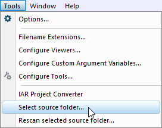

* A new window titled __Browse for Folder__ will show up pointing initially to the folder where the `.ewp` file is. From there, select the desired source tree folder that will populate the active project. Usually the project's top directory will be chosen. For example:

>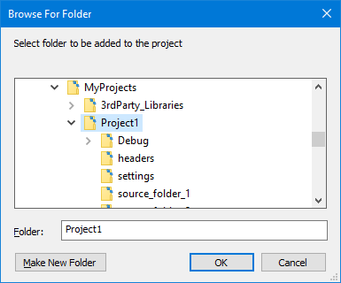
>
>:warning: Please notice that the __EWPtool__ is also able to add folders that are located on any upper or lower level relative to the `.ewp` file, as far as the chosen folder belongs to **the same drive in which the project file is stored (i.e. C:, D:, etc.)**.
>
>:bulb: The selected folder is saved in `settings/<PROJ_FNAME>.cfg` so it can be used later with the command `Tools` → `Rescan selected source folder...`, which will skip the __Browse for folder__ dialog.

* The IDE will then tell you that the `<path-to>/<project-name>.ewp` project file has been modified on "disk" and will offer to __reload the project__. This happens because the __EWPtool__ scanned the selected source tree, found changes, and updated entries in the project tree layout. Click on the `Yes` button to allow the IDE to reload the project.

>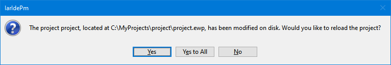

* Reloading the project will recursively add the source files from the selected folder to the current build configuration ("Debug" in this example). The result can be verified by unfolding the groups, located in the project's __Workspace window__:
 
>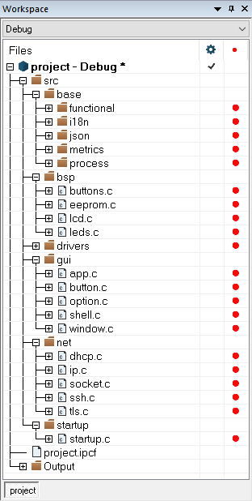

And this is what you need to know to start using the __EWPtool__ utility. 

The following sections will provide further information related to the project's customizations as well as some important migration details.

### Appending extra source code
Many embedded software projects use 3rd-party source code to support the actual application. If these components were located within the project's source tree, they would be already appended to the project layout from the time the project's directory was selected.

That's not always the case. Let's consider one use case where pieces of the application might be located on a parent level, outside the project's source tree. Perhaps because these components are used on other projects and are maintained separately. If that's the case, the __EWPtool__ utility can help on populating the project with them.

For this fictional example let's consider using the __EWPtool__ a second time for adding another folder, named `3rd-party-components`. The folder is located on the same level where the project's directory is located (`../$PROJ_DIR$`):

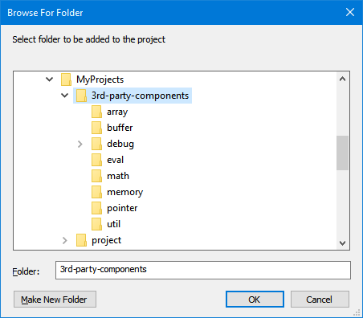

When selecting source folders located above `$PROJ_DIR$`, one or more groups named `..` are created as reference to how many levels above the `$PROJ_DIR$` the extra source folders are located, reflecting the arrangement of these source files on the filesystem. On the logical layout this grouping convention helps to identify where the extra source files are located relatively to the `$PROJ_DIR$`.

><!-- 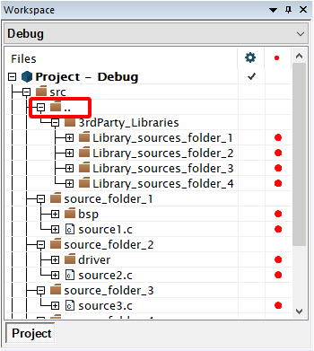 -->

>:bulb: [`$PROJ_DIR$`][url-iar-doc-proj-dir] is an IDE's internal __argument variable__ which translates to the absolute path for the location where the `.ewp` file is stored.

### Source code detection
The __EWPtool__ utility detects source file types from the selected source tree by their extension. The file extensions that are automatically detected are specified in the table below.

| Source file type | Detected extensions                                                                                      |
|------------------|----------------------------------------------------------------------------------------------------------|
|C sources         | `*.c`                                                                                                    |
|C++ sources       | `*.cc`, `*.cpp`                                                                                          |
|Assembly sources  | `*.s`, `*.asm`, `*.msa`, `*.s90` (AVR), `*.s51` (8051), `*.s43` (430), `*.s26` (78K), `*.s85` (V850) |

>:bulb: If a project requires any pre-built static library (i.e. `<library-name>.a`), these must be manually added to the project (i.e. via `Project Options` (<kbd>ALT</kbd>+<kbd>F7</kbd>) → `Linker` → `Libraries`).

## Customizations
Once we get all the desired files automatically appended to the project, the project can be customized from the IDE.

### Rearranging project layout 
The project's groups nodes can be customized from the __Workspace window__. 

- __Rearranging a group (or a file) node__:
   -  can performed through simple drag'n drop operation.

- __Renaming a group node__:
   - Click to highlight the desired group node.
   - Right-click for its context menu. Use the `Rename` command.

- __Remove empty group node__:
   - Click to highlight the undesired group node.
   - Remove it from the project using the <kbd>DEL</kbd> key.

### Excluding sources from the active build configuration
There are cases where not every single source file present in a folder should be used on every build configuration at the same time. Perhaps due multiple implementations of the same functions but with different trade-offs. In those cases, a choice should be made.

In our fictional project example, this happens with the __buffer__ component where a type choice must be made among the `type A`, `type B` and `type C`. 

Let's say we decide that our project needs the `type A` buffer implementation. We need to exclude `type B` and `type C` from the current build configuration. 

There are at least a couple of ways of accomplish this in the __Workspace window__:

- __Remove the undesired files from the project layout__:
   - Highlight each of the undesired file nodes (`buffer_typeB.c` and `buffer_typeC.c`).
   - Remove them from the project layout by pressing the <kbd>DEL</kbd> key.
or...

- __Exclude the undesired files from the build__:
    -  For each of the undesired file nodes: right-click and select: `Options` → `Exclude from build`.
or...

- __Create an "excluded" group__:
   - Create a new group (i.e. `excluded`) inside the desired group.
   - Right-click on the `excluded` group and select: `Options` → `Exclude from build`.
   - While holding <kbd>SHIFT</kbd>, select multiple files (i.e. click on `buffer_typeB.c` followed by `buffer_typeC.c`).
   - Finally drag the selection and drop these files inside the `excluded` group. By consequence, they will be excluded from the current build configuration (the example depicts "Debug").

>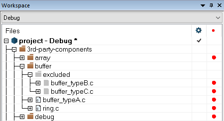
>
>:warning: Notice that when a group or a file is __excluded from build__, its icon becomes grayed.
>
>:warning: Excluding sources from the current build configuration does not propagate to other build configurations.
>
>:bulb: Once the layout was customized, save the project by choosing `File` → `Save All`. Alternatively, click the `Save All` icon in the __main toolbar__.
>
>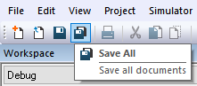

## Great! Now what?
As we have seen, the sole purpose of the __EWPtool__ is to be one of the developer's sidekicks when it comes to quickly populate a new (or an existing) project with existing source folders.

Although, we are not done yet with the project preparation.

Creating a project from scratch essentially requires some adjustments, so it can get properly configured. 

Typically, the project options need to be in accordance with, at least:
- the [target device](#target-device-selection) that will be used
- the [runtime library](#runtime-library-configurations) configurations
- the [C/C++ compiler optimizations](#cc-compiler-optimizations)
- the [linker](#linker-configurations) configuration
- the [debugger](#configurations) configuration
  
Even so, the _IAR Embedded Workbench IDE_ makes it straightforward to change such project configurations.

Now let's take a look at how to access such project options, alongside some ideas that might help you.

### Target Device Selection
How to access:
* Open the project’s options with `Project` → `Options` (<kbd>ALT</kbd>+<kbd>F7</kbd>).
* Navigate to the `General Options` → `Target` tab.

The __Target__ tab will allow you to select the target device. This tab will present itself slightly different depending on the _IAR Embedded Workbench_ architecture in use. The screenshots below were taken from the __Arm__ and __RISC-V__ flavors, respectively:  

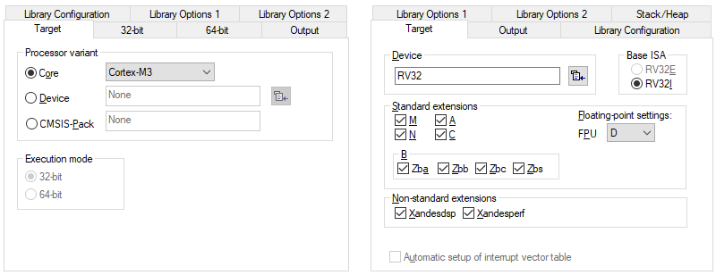

### Runtime library Configurations
How to access:
* Open the project’s options with `Project` → `Options` (<kbd>ALT</kbd>+<kbd>F7</kbd>).
* Navigate to the `General Options` → `Library Configuration` tab. 

The __Library Configuration__ tab allows us to configure the runtime library options such as locale support, multibytes in `printf()`, low-level interface implementation for `stdout/stderr`, etc. 

This tab might be especially interesting for __Arm__ users working with [CMSIS](https://developer.arm.com/tools-and-software/embedded/cmsis)-based projects; case in which the `Use CMSIS` option might have to be enabled.

### C/C++ Compiler Optimizations
How to access:
* Open the project’s options with `Project` → `Options` (<kbd>ALT</kbd>+<kbd>F7</kbd>).
* Navigate to the `C/C++ Compiler` → `Optimizations` tab.

In the __Optimizations__ tab you can easily choose the optimization level from __None__ up to __High__.

When __High__ is selected, it is possible to select among 3 different optimization objectives:

- `Size` means the smallest code size. This objective can be selected when minimizing the program memory consumption is more important than execution speed.

- `Speed` means code that executes faster. This objective can be selected when speed is more important than the code size. 

- `Balanced` will use heuristics for making decisions on the transformations used for each piece of code. This objective can be selected to make the code run as fast as possible, whenever it doesn’t mean a toll in terms of code size.

The `Enabled Transformations` can be cherry-picked when higher optimization levels are selected. When enabled, these transformations significantly affect the code generation for the better. 

>:bulb: When __debugging__ code, it is recommended to leave the compiler optimization level on __None__ or __Low__, where those transformations do not happen, so the generated code will have a better correlation with the source code. A lower optimization level provides better visibility for debugging purposes. The "Debug" configuration uses the __Low__ level as default. 

>:bulb: When the application is ready for its __Release__, with its source code already debugged, the compiler optimization level can be raised to __High__ as in the "Release" build configuration. The __Workspace window__ offers a build configuration drop-down box which allows to quickly switch back and forth between these build configurations:
>
>

>:bulb: When the __High/Speed__ level is selected, the check box `No size constraints` can be enabled. This option will generate code that executes as fast as possible.
> 
> 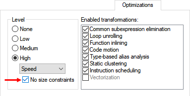

### C/C++ Compiler Preprocessor
How to access:
* Open the project’s options with `Project` → `Options` (<kbd>ALT</kbd>+<kbd>F7</kbd>).
* Navigate to the `C/C++ Compiler` → `Preprocessor` tab.

By default, a project created with the _IAR Embedded Workbench_ will search for C/C++ header files in the toolchain's headers default locations (`$TOOLKIT_DIR$/inc`) as well as in the project directory (`$PROJ_DIR$`). 

In this tab, it is possible to specify __Additional Include Directories: (one per line)__ here.

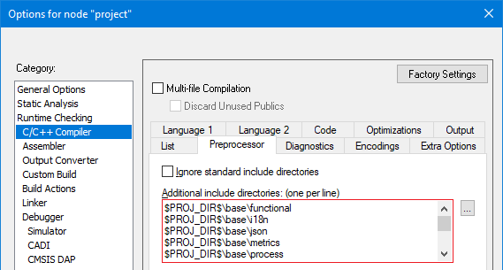

>:bulb: When one or more source folders are added to the project using the __EWPtool__, it will recursively detect any folders containing header files (any files with the __.h__ or the __.hpp__ extensions). Then it will fill the C/C++ Preprocessor entries accordingly.

>:bulb: This is also where symbols could be specified. One possible scenario, for example, would be taking an originating *Makefile* in search of any application's required symbols. Once they are found, it is just about bringing these symbols to the `Defined Symbols` box. For example: 
> 
> 

### Linker configurations
Once the [target device](#target-device-selection) is selected:
* Open the project’s options with `Project` → `Options` (<kbd>ALT</kbd>+<kbd>F7</kbd>).
* Navigate to the `Linkter` → `Config` tab. 

The linker configuration file (`*.icf`) will automatically change according to the selected target. The target's default linker configuration should be ready to use the programs with no specific flash partitioning requirements (*as it would be, for example, in a bootloader application*) to run with no issues. Even then, if a specific configuration is needed for the project, it is just about enabling `Override default` for the configuration:

### Debugger Configurations
How to access:
* Open the project’s options with `Project` → `Options` (<kbd>ALT</kbd>+<kbd>F7</kbd>).
* Navigate to the `Debugger` → `Setup` tab. 

In this tab you can switch to the __Driver__ for of the supported debugging probes of your choice. The list of drivers changes according to the target architecture in use.

>:bulb: For the optimal experience with __Arm__ or __RISC-V__ targets, we recommend the [__IAR I-jet probes__](https://iar.com/ijet).
 
>:bulb: Each of the _IAR Embedded Workbench_ brings an integrated __simulator__ for its target architecture. The simulator makes possible for you to start debugging your project even when board isn’t there yet. To learn more about the IAR C-SPY simulator, its interrupt simulation capabilities and its powerful macro system, go to `Help` → `Information Center` → `Product explorer` and take a look on the related tutorials.

### Source code migration
If the original source code was written using _Standard C_ or _Standard C++_, it is likely that you are good to go.

>:bulb: When migrating sources that use non-portable code (i.e. compiler-specific extensions), a developer needs to review and migrate such code manually. The steps involved in porting code are often architecture-dependent and these steps are beyond the scope of this tutorial. Device-specific startup files are, in many cases, bundled with the _IAR Embedded Workbench_ project examples in the Information Center, accessible from the IDE's main menu: `Help` → `Information Center` → `Example projects`.

For more information, refer to the __User Guides__ directly from the [IAR Systems Support page](https://www.iar.com/knowledge/support). If you have the product already installed on your workstation, it is possible to access its __User Guides__ from the IDE's main menu: `Help` → `Information Center` → `User guides`.

## Issues
Found an issue or have a suggestion related to the __EWPtool__? Feel free to use the public issue tracker.
- Do not forget to take a look on [earlier issues][url-repo-issue-old].
- If creating a [new][url-repo-issue-new] issue, please describe it in detail.

## Summary
This short tutorial offered general guidelines with tips and shortcuts for developers willing to get a speedup factor when migrating a project, from scratch, to the _IAR Embedded Workbench_.

<!-- Links -->
[url-repo-issue]:     https://github.com/IARSystems/project-migration-tools/issues
[url-repo-issue-new]: https://github.com/IARSystems/project-migration-tools/issues/new
[url-repo-issue-old]: https://github.com/IARSystems/project-migration-tools/issues?q=is%3Aissue+is%3Aopen%7Cclosed

[url-repo-tool-release-dl]: https://github.com/IARSystems/project-migration-tools/releases/download/4.1.7/EWPtool-4.1.7.zip
[url-repo-tool-release-rn]: https://github.com/IARSystems/project-migration-tools/releases/tag/4.1.7

[url-iar-migration]: https://iar.com/products/project-migration-tools
[url-iar-doc-proj-dir]: https://wwwfiles.iar.com/arm/webic/doc/EWARM_IDEGuide.ENU.pdf#page=89
