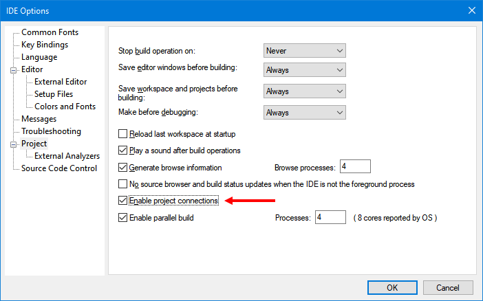
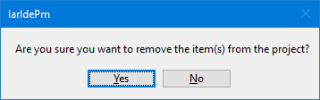
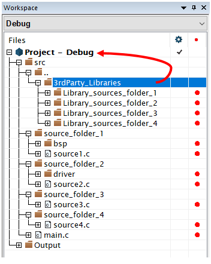
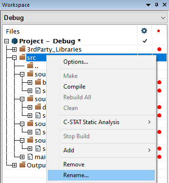
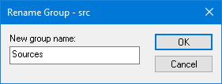

## Tutorial Getting Started with the EWPtool

If you want to be notified in your GitHub inbox about updates to this tutorial, you can start __watching__ this repository. You can customize which types of notification you want to get. Read more about [notifications](https://docs.github.com/en/github/managing-subscriptions-and-notifications-on-github/setting-up-notifications/about-notifications) and how to [customize](https://docs.github.com/en/github/managing-subscriptions-and-notifications-on-github/setting-up-notifications/about-notifications#customizing-notifications-and-subscriptions) them.

If you end up with a question specifically related to [this tutorial](https://github.com/iarsystems/project-migration-tools), you might be interested in verifying if it was already answered from [earlier questions][repo-old-issue-url]. Or, [ask a new question][repo-new-issue-url] if you could not find any answer for your question.

## Frequently Asked Questions
### What is the EWPtool utility?
__EWPtool__ is a small utility that can help to speed-up when populating an __IAR Embedded Workbench__ project with an existing source code tree.

Currently the IDE allows adding source files from a single folder at a time, which is fine for a few folders. Although, this process can become time-consuming in cases where there are too many folders. The EWPtool is an external utility that integrates pretty well to the IDE, allowing it to perform the task of populating a project with an entire source tree at once. The bigger the source tree is, the bigger is the benefit this utility offers.

### What does EWPtool not do?
__EWPtool__ does __not__ directly convert existing project files created with 3rd-party IDEs.

Some flavors of the IAR Embedded Workbench offer built-in Project Converter tools that can convert projects created using 3rd-party IDEs. The __EWPtool__ utility is not a requirement for when using those tools. In those cases, you can safely disregard this tutorial. Instead, please visit the "Migration Guides" section in the official [Project Migration tools](https://www.iar.com/products/project-migration-tools/) page for more information specific to those tools.

### What is required for the EWPtool to function?
The __EWPtool__ uses the IPCF (_IAR Project Connection File_) feature. This feature is implemented on any reasonably recent versions of the __IAR Embedded Workbench IDE__.

Make sure this feature is enabled in `Tools` → `Options` → `Project` → `Enable Project Connections`.

## Installation
The installation of the __EWPtool__ utility is simple. Please follow the steps below:

1. Close all the instances of the __IAR Embedded Workbench IDE__.
2. Download the archive with the latest release of the [EWPtool utility](https://github.com/IARSystems/project-migration-tools/releases/download/3.1.0/EWPtool-3.1.0.zip).
3. Extract the zip archive contents inside the `<path-to>/<iar-embedded-workbench-installation-folder>`, on top of its existing `common` folder.
4. Launch the __IAR Embedded Workbench IDE__.

>:warning: If multiple instances of the _IAR Embedded Workbench_ are installed on different locations, this __EWPtool__ installation process must be repeated for each instance in which the __EWPtool__ is going to be used with.

## General usage guidelines
The project layout in the IAR Embedded Workbench is logical. This means that, whenever desired, source files could be added and grouped in a completely different way than the way they are actually arranged in the filesystem.

The __EWPtool__ populates a project reflecting the source tree layout so the logical layout matches the layout from the filesystem.

### Adding the project's sources
This section provides a general overview on how the __EWPtool__ can be used to quickly populate projects with existing source code.

>:warning: All the examples below are solely for illustrative purposes.

* Create a __New Empty Project__ by choosing `Project` → `Create New Project` → `Empty Project` → `OK`.

* A __Save As__ dialog will show up. Save the IAR **E**mbedded **W**orkbench **P**roject file (`<project-name>.ewp`) in the project's source tree top level folder.

* Select `Tools` → `Add new source folder…`.

* A new window titled __Browse for Folder__ will show up pointing initially to the folder with the project file. From there, select the desired source tree folder that will be appended to the active project. Usually the project's top directory will be chosen. For example:

>:warning: Please notice that the __EWPtool__ is also able to add folders that are located on any upper or lower level relative to the project file, as far as the chosen folder belongs to **the same drive in which the project file is stored (i.e. C:, D:, etc)**. You can read more about it in the section [Appending extra source code](#appending-extra-source-code) below.

* The IDE will then tell you that the `<path-to>/<project>.ewp` project file has been modified on "disk" and will offer to reload the project. This happens because the __EWPtool__ automatically added a `<project>.ipcf` file to the project layout. Click on the `Yes` button to reload the project.

* Reloading the project with the `<project>.ipcf` will recursively append the existing source files from the previously selected folder to the current project layout. The result can be verified by unfolding the group named `src`, located on the project's layout top level in the `Workspace window`. For example:
 

>:warning: If desired, the current layout for these groups can be tweaked later on. Please refer to [Customizing the project tree layout](#customizing-the-project-tree-layout) for more information.

### Appending extra source code
Many embedded software projects use 3rd-party source code to support the actual application. If these components were located within the project's source tree, they would be already appended to the project layout from the time the project's directory was selected.

Still, there are more complex scenarios where pieces of the application might be located on a parent level, outside the project's source tree. Perhaps because these components are used on other projects and are maintained separately. If that's the case, the __EWPtool__ utility also can help populate the project with them.

For this example, let's consider adding a folder named `3rd-party-components`, located one level above (`..`) the project's directory (__$PROJ_DIR$__), using the __EWPtool__ utility a second time:

When adding directories located above __$PROJ_DIR$__, one or more groups named `..` are created as reference to how many levels above the __$PROJ_DIR$__ the extra source folders are located, reflecting the arrangement of these source files on the filesystem. On the logical layout this grouping helps to identify where the extra source files are located relatively to the __$PROJ_DIR$__.

>:warning: [$PROJ_DIR$](https://wwwfiles.iar.com/arm/webic/doc/EWARM_IDEGuide.ENU.pdf#page=85) is an IDE's internal [argument variable](https://wwwfiles.iar.com/arm/webic/doc/EWARM_IDEGuide.ENU.pdf#page=85) which translates to the absolute path for the location where the project file is stored.

### Preprocessor entries
By default, a project created with the IAR Embedded Workbench will search for C/C++ header files in the toolchain's headers default locations as well as in the $PROJ_DIR$. 

The IDE provides a simple way for other search locations to be added from the Project Options (`C/C++ Compiler` → `Preprocessor` → `Additional Include Directories: (one per line)`).

When one or more source folders are added to the project using the __EWPtool__, it will recursively detect any folders containing header files (any files with the __.h__ or the __.hpp__ extensions). Then it will fill the C/C++ Preprocessor entries accordingly. For example:

This automation will propagate through every existing build configuration within the project (i.e. "Debug", "Release", etc.).

>:warning: The same automation will populate with the __Additional include directories__ for the __Assembler Preprocessor__ (`Assembler` → `Preprocessor` → `Additional Include Directories: (one per line)`).

### Source code detection
The __EWPtool__ utility detects source file types by their extension. The file extensions that are automatically detected are specified in the table below.

| Source file type | Detected extensions                                                                                     |
|------------------|---------------------------------------------------------------------------------------------------------|
|C sources         | `*.c`                                                                                                   |
|C++ sources       | `*.cc`, `*.cpp`                                                                                         |
|Assembly sources  | `*.s`, `*.asm`, `*.msa`, `*.s90` (AVR), `*.s51` (8051), `*.s43` (430), `*.s26` (78K), `*.s85` (V850) |

>:warning: Any required pre-built static libraries must be manually added to the project.

## Customizing the project tree layout
Once we get all the desired files automatically appended to the project, we can think of ways of customizing the project layout in the __Workspace window__, according to any particular preferences.

Let's now consider that the `3rd-party-components` group should be on the same level of the `src` group. Also, `src` might not be as descriptive as `Application` for one's tastes, and so on.

### Removing the IAR Project Connection File (IPCF)
The nodes layout inside the `src` group is __persistent__. This happens while they are managed by the IAR Project Connection File (`*.ipcf`). This property is also true for the additional directories in the preprocessor settings. Severing this connection will cease this property and all the persistent nodes will become editable again. In order to get to that, the `<project>.ipcf` must first be removed from the project. If that's the case, please proceed as follows: 

* Right-click on the `<project>.ipcf` file and choose `Remove` from its context menu. (Alternatively, it is possible to highlight the file and press the <kbd>DEL</kbd> key.)

* A question dialog will pop-up for confirmation of its removal. Confirm the removal by clicking `Yes`.

>:warning: Removing the `<project>.ipcf` file from the project will not delete the file from its original location within the filesystem.

### Rearranging the project layout 
Once the `<project>.ipcf` is removed from the project, it becomes possible to rearrange groups (and/or files) nodes created with the __EWPtool__ within the __Workspace window__. This normally can be performed through simple drag'n drop operations. 

* Dragging the `3rd-party-components` group and dropping it on top of the project's name will move it, as shown below:

>:warning: After moving the `3rd-party-components` node to the project's layout top level, the group `..` became empty, hence it can be safely removed from the project layout using the <kbd>DEL</kbd> key.
 
* Renaming the `src` group can be performed by a right-click on top of this group followed by the `Rename...` command:

* A modal window titled `Rename group <current-group-name>` will show up. Fill with the desired string (i.e. `Application`) and finish the operation by clicking on `OK`:

* Once you have the project layout the way you see fit, save the project by choosing `File` → `Save All` or else click the `Save All` icon in the __main toolbar__.

### Excluding sources from the build configuration
There are cases where not every single source file present in a folder should be used on a build configuration at the same time. Perhaps due multiple implementations of the same functions but with different trade-offs. In those cases, a choice should be made.

In our fictional project example, this happens with the __buffer__ component where a type choice must be made among the `type A`, `type B` and `type C`. 

Let's say we decide that our project needs the `type A` buffer implementation. We need to exclude `type B` and `type C` from the current build configuration. 

There are at least a couple of ways of accomplish this in the __Workspace window__:

- __Remove the undesired files from the project layout__:
   - Highlight each of the undesired file nodes (`buffer_typeB.c` and `buffer_typeC.c`).
   - Remove them from the project layout by pressing the <kbd>DEL</kbd> key.
or...

- __Exclude the undesired files from the build__:
    -  For each of the undesired file nodes: right-click and select: `Options` → `Exclude from build`.
or...

- __Create an "excluded" group__:
   - Create a new group (i.e. `excluded`) inside the desired group.
   - Right-click on the `excluded` group and select: `Options` → `Exclude from build`.
   - While holding <kbd>SHIFT</kbd>, select multiple files (i.e. click on `buffer_typeB.c` followed by `buffer_typeC.c`).
   - Finally drag the selection and drop these files inside the `excluded` group. By consequence, they will be excluded from the "Debug" build configuration.

>:warning: Notice that when a group or a file is __excluded from build__, its icon becomes grayed.

>:warning: Excluding sources from the current build configuration does not propagate to other build configurations.

## Great! Now what?
As we have seen, the purpose of the __EWPtool__ is to help developers to quickly populate a new (or even an existing) project with one (or more) directories containing source files, headers and static libraries. This tool can help to save a substantial amount of time, especially when it comes to projects with many sub-directories. 

Although, we are not done yet. There are some extra adjustments to look for when migrating projects from scratch like this, so it gets properly configured. The project needs to be in accordance with the used target device, library configuration, the compiler’s optimization levels, linker configurations, debug probe driver and so on. Even then, the __IAR Embedded Workbench__, for all of its supported architectures, makes it very easy to change these settings.

Now let's take a look at the basics.

### Target Device Selection
Open the project’s options with `Project` → `Options` (<kbd>ALT</kbd>+<kbd>F7</kbd>) and navigate to the `General Options` → `Target` tab. This tab will allow you to select the target device. 

The __Target__ tab will present itself slightly different depending on the __IAR Embedded Workbench__ architecture in use. The screenshots below were taken from the __Arm__ and __RISC-V__ flavors, respectively:  

### Library Configuration
The __Library Configuration__ tab from the __General Options__ might be especially interesting for __Arm__ users working with [CMSIS](https://developer.arm.com/tools-and-software/embedded/cmsis)-based projects; case in which the `Use CMSIS` option should be selected.

### C/C++ Compiler Optimizations
In the `C/C++ Compiler` category, under the `Optimizations` tab you can easily choose the optimization level from __None__ up to __High__.

When __High__ is selected, it is possible to select among 3 different optimization objectives:

- `Size` means the smallest code size. This objective can be selected when minimizing the program memory consumption is more important than execution speed.

- `Speed` means code that executes faster. This objective can be selected when speed is more important than the code size. 

- `Balanced` will use heuristics for making decisions on the transformations used for each piece of code. This objective can be selected to make the code run as fast as possible, whenever it doesn’t mean a toll in terms of code size.

> * When the __High/Speed__ level is selected, the check box `No size constraints` can be enabled. This option will generate the code to run as fast as possible.
> 
> 

The `Enabled Transformations` can be cherry-picked when higher optimization levels are selected. When enabled, these transformations significantly affect the code generation for the better. Although, when __debugging__ code, it is recommended to leave the compiler optimization level on __None__ or __Low__, where those transformations do not happen, so the generated code will have a better correlation with the source code. A lower optimization level provides better visibility for debugging purposes. The "Debug" configuration uses the __Low__ level as default. 

When the application is ready for its __Release__, with its source code already debugged, the compiler optimization level can be raised to __High__ as in the "Release" build configuration. The __Workspace window__ offers a build configuration drop-down box which allows to quickly switch back and forth between these build configurations:

### C/C++ Compiler Preprocessor
Another tab which is commonly used when migrating projects to the __IAR Embedded Workbench__ is the `Preprocessor` tab in the `C/C++ Compiler` category. This is where symbols could be specified.

One possible scenario, for example, would be checking an originating *Makefile* in order to find any required symbols. Once they are found, it is just about bringing these symbols to the `Defined Symbols` box. For example: 

### Linker configuration
Once you have your [target device selected](#target-device-selection), the linker configuration file (`*.icf`) will automatically change to one common configuration, as it can be seen on the `Config` tab, under the `Linker` category. The default linker configuration should allow the programs with no specific flash partitioning requirements (*as it would be, for example, in a bootloader application*) to run with no issues. Even then, if a specific configuration is needed for the project, it is just about enabling `Override default` for the configuration:

### Debugger Configuration
The last essential category to keep in mind when migrating projects to the __IAR Embedded Workbench__ is the `Debugger` category. Here you will find the `Setup` tab, where you can easily choose among several different supported debugging probes. For the optimal experience, we recommend the [__IAR I-jet probes__](https://www.iar.com/ijet). 

Worth mentioning that all the different __IAR Embedded Workbench__ architecture flavors come with an integrated __Simulator__ which allows you, for example, to start debugging the code of your project even when the actual target board isn’t ready yet. 

To learn more about the __Simulator__, its interrupt simulation capabilities and the __C-SPY macros__, visit the __Product explorer__ from the IDE's main menu: `Help` → `Information Center` → `Product explorer` and try those tutorials.

### Source code migration
If the original source code was written using _Standard C_ or _Standard C++_, it is likely that you are good to go.

When migrating sources that use non-portable code (i.e. compiler-specific extensions), a developer needs to review and migrate such code manually. The steps involved in porting code are often architecture-dependent and these steps are beyond the scope of this tutorial. Device-specific startup files are, in many cases, bundled with the IAR Embedded Workbench project examples in the Information Center, accessible from the IDE's main menu: `Help` → `Information Center` → `Example projects`.

For more information, refer to the __User Guides__ directly from the [IAR Systems Support page](https://www.iar.com/knowledge/support). If you have the product already installed on your workstation, it is possible to access its __User Guides__ from the IDE's main menu: `Help` → `Information Center` → `User guides`.

## Summary
This short tutorial offered general guidelines with tips and shortcuts for developers willing to get a speedup factor when migrating a project, from scratch, to the IAR Embedded Workbench.

In a [video](https://www.youtube.com/watch?v=xtmpmy8t19Q) we show step-by-step one use case where the __EWPtool__ excels when migrating, from scratch, a RTOS project with a relatively complex source tree.

<!-- Links -->
[repo-new-issue-url]: https://github.com/IARSystems/project-migration-tools/issues/new
[repo-old-issue-url]: https://github.com/IARSystems/project-migration-tools/issues?q=is%3Aissue+is%3Aopen%7Cclosed
