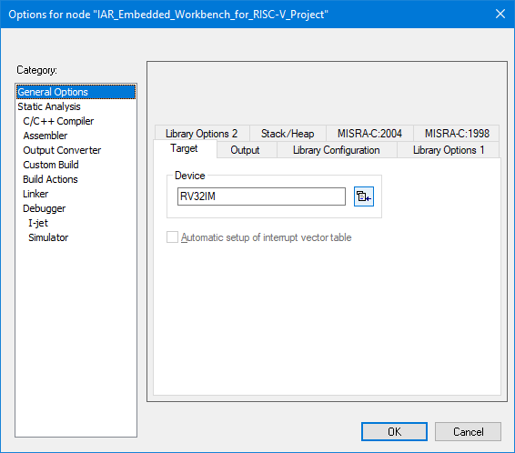
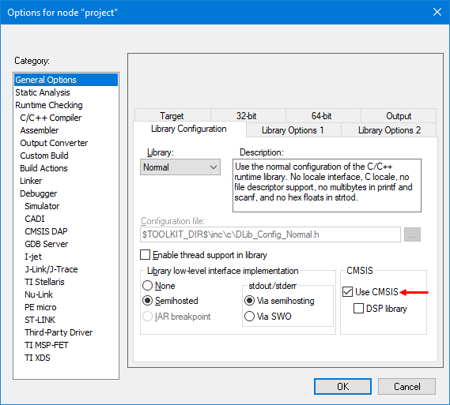
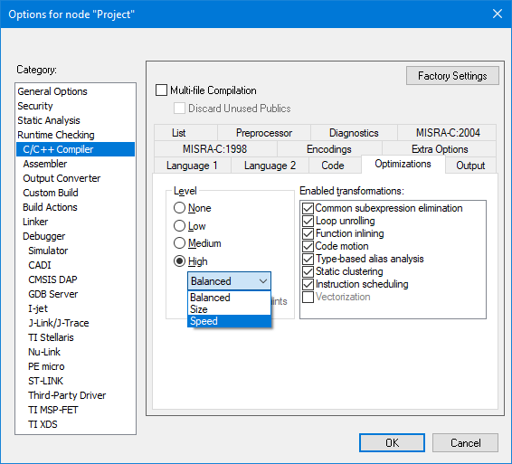
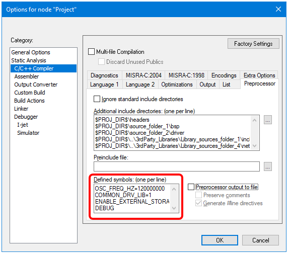
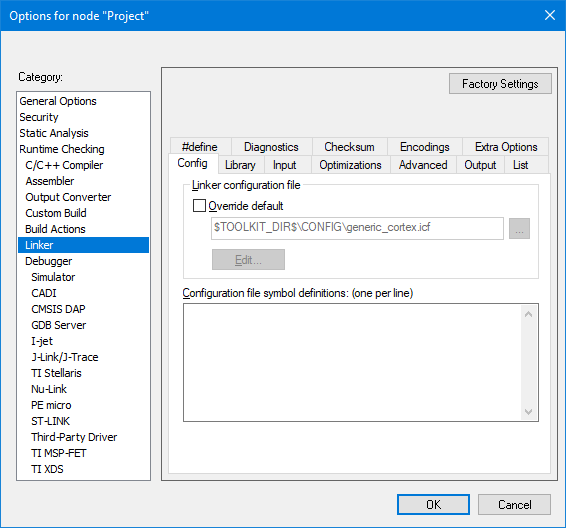
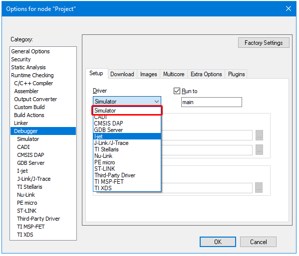
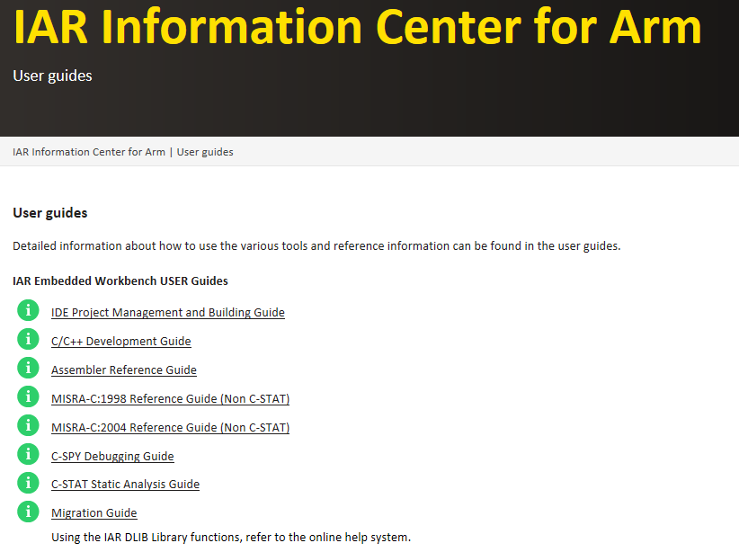

## Tutorial: Getting Started with IAR EWPtool 3.04

## Table of Contents

* [Introduction](#introduction)
* [Installation](#installation)
* [Usage Guidelines](#usage-guidelines)
* [Customizing the project tree layout](#customizing-the-project-tree-layout)
* [What are the next steps?](#what-are-the-next-steps)
  * [Target Device Selection](#target-device-selection)
  * [Library Configuration](#library-configuration)
  * [Compiler's Optimization Levels](#compilers-optimization-levels)
  * [Compiler's preprocessor](#compilers-preprocessor)
  * [Linker Configuration](#linker-configuration)
  * [Debugger Configuration](#debugger-configuration)
* [Summary](#summary)

## Introduction
__EWPtool__ is a small utility that populates an __IAR Embedded Workbench__ project with a chosen source folder tree.

## Installation
The __EWPtool__ should be installed under a previously installed __IAR Embedded Workbench__ folder.

### Procedure

**1.** Execute the installer: [iar_ewptool_setup_3.04.exe](installer/iar_ewptool_setup_3.04.exe).

**2.** Accept the *Software License Agreement*.

**3.** The installer will initially point to the __IAR Systems__ folder in the __Program Files__ folder. Type the desired path or click the `Browse` button.

**4.** Unfold the __IAR Systems__ folder and choose which __Embedded Workbench__ should be used for the installation. Once the choice has been made, click the `OK` button to continue.

**5.**	Verify the chosen path and then click the `Next` button.

**6.** When you are ready to install, confirm by clicking the `Install` button.

**7.** And finally, click `Finish` to exit the setup program.

## Usage guidelines

**1.** __EWPtool__ is simple and easy to use. Whenever in an existing project or in a new project, go to `Tools` → `Add new source folder…`.

**2.** A new window titled __Browse for Folder__ will show up pointing to the project’s folder (__$PROJ_DIR$__). Select the desired source folder to be added to the active project. For example:

**3.** The IDE will then tell you that the {project name}__.ewp__ (*Embedded Workbench Project*) has been modified on disk and then you will be offered to reload the project. Click on the `Yes` button to reload the project.

**4.** The project will be automatically populated by all the source files within the selected folder, recursively, as it can be seen on the `Workspace Window`. A group named *src*  will be created on the top level of the project tree. Notice that a {project name}__.ipcf__ (*IAR Project Connection File*) also was added. For example:
  
 
 
**5.** It is possible to further `Add new source folder...` on an existing project. Before moving forward, save the current project by choosing `File` → `Save All`. 

**6.** Folders located above the Project’s directory (__$PROJ_DIR$__) can also be added. Once again, perform `Tools` → `Add new folder…`. For example: 

**7.** As for our example, the *3rdParty_Libraries* folder is located one level above (“..”) the Project’s Directory (__$PROJ_DIR$__). For every level above the Project's directory, a group named ".." is created within the *src* group. This feature is particularly useful, as it shows the relative path to the added folders when working under a group perspective. All the added files added by the __EWPtool__ will have their paths relative to the __$PROJ_DIR$__.

**8.** __EWPtool__ will also recursively populate the Project’s C/C++ preprocessor include directories with any folders containing header files (__.h__ or __.hpp__ extensions). For example:

## Customizing the project tree layout
Once we got all the involved files added to the project, it is possible to customize the project’s source tree structure in the `Workspace Window`, according to any particular preferences.
Based on our example project, let’s imagine someone wants to have the *3rdParty_Libraries* group at the same level of the *src* group. Perhaps even prefer to have a *Sources* group instead of one *src* group. Given that the tool already populated the project with the needed files, those references are mantained if the groups are moved around, or even renamed. These small cosmetic changes are easy to achieve and here is how: 

**1.** Right-click on the {project name}__.ipcf__ file and choose `Remove`. You can alternatively highlight the file and press the `Del` key.
  
**2.** A question dialog will pop-up asking for item removal. Confirm the removal of the item by clicking on the `Yes` button.  The .ipcf file itself won't be erased from the project folder. 

**3.** Once the {project name}__.ipcf__ is removed from the Project, it is possible to move the groups which have been created when adding source folders. Save the Project by selecting `File` → `Save All`.

**4.** Now use the mouse to drag the desired group (in this case *3rdPartyLibraries*) and drop it on top of the __Project__ name as shown below:

 
**5.** To rename the *src* group, right-click on it and choose `Rename…`.

**6.** Type in the desired `New group name` and finish the operation by clicking `OK`.

**7.** Once you have your project the way you see fit, save the project by choosing `File` → `Save All` or else click the `Save All` button in the __toolbar__.

## Remarks
- The __EWPtool__ utility will open a Windows shell dialog window for you to choose a new source folder to be added to the project. The chosen folder can be located on any level above or below the *project path* as long as it belongs to **the same drive in which the project is stored** (*i.e. C:, D:, etc*).

- The file types which are automatically added by the __EWPtool__ to the project tree in the `Workspace Window` are:

| Source file type | Extension           |
|------------------|---------------------|
|C sources         | __*.c__             |
|C++ sources       | __*.cc__, __*.cpp__ |
|Assembly sources  | __*.s__             |
|Static libraries  | __*.a__             |

- Any folders containing header files (__.h__ and __.hpp__ extensions) are going to be automatically added to the preprocessor search path for the __C/C++ Compiler__ and also for the __Assembler__ in their corresponding Project options tab. This automation will be propagated to every existing `Debug Configuration`, which is typically *Debug* and *Release*.

## What are the next steps?
The main purpose of the __EWPtool__ is to help you to quickly populate your new (or existing) project with all the necessary source files, headers and static libraries. This tool can help save a huge amount of time, especially when it comes to bigger projects. Although, we are not done yet. There are some extra adjustments to look for when migrating projects like this, so it gets properly configured. It needs to be  in accordance with the used target device, library configuration, the compiler’s optimization levels, linker configurations, debug probe driver and so on. Even then, the __IAR Embedded Workbench__, for all of its supported architectures, makes very simple and quick to change those settings.

### Target Device Selection
Open the project’s options with `Project` → `Options (ALT+F7)` and navigate to the `General Options` → `Target`. This tab will allow you to select the target device and it may present itself in a slightly differently yet familiar manner, depending on the __IAR Embedded Workbench__ architecture in use. Below you can see how the `Target` tab looks like for *Arm* and for *RISC-V*:  

   

### Library Configuration
Once you chose the device, you could move to the __Library Configuration__ tab to check some options. For *Arm* users, this tab is especially interesting if working with CMSIS-based projects; case in which, the `Use CMSIS` option should be selected.

### Compiler's optimization levels
On the `C/C++ Compiler` category, under the `Optimizations` tab you can easily choose the optimization level from __None__ up to __High__. When __High__ is selected, it is possible to select among 3 different optimization objectives:

- `Size`, which means the smallest code size. Typically used to save flash memory resources when flash memory cost is more important than speed.

- `Speed`, which means a much faster code in which typically incurs some extra flash memory consumption as a trade-off.

- `Balanced`, will use heuristics with the objective of making smart decisions on every piece of code in order to make it run as fast as possible if it doesn’t come with a great toll in the code size.

The `Enabled Transformations` can significantly affect the code generation. In order to get a better correlation between the written sources and the produced code during the debugging phase, it is recommended to leave the compiler optimization level on __None__ or __Low__ for *Debug*. Then, later on, as the application becomes ready for *Release* and the code has been already debugged, the level can be raised to __High__.

### Compiler's preprocessor
Another tab which is commonly used when migrating projects to the __IAR Embedded Workbench__ is the `Preprocessor` tab in the `C/C++ Compiler` category. This is where symbols could be specified. One possible scenario, for example, would be checking an originating *Makefile* in order to find any required symbols. Once they are found, it is just about bringing these symbols to the `Defined Symbols` box. For example: 

### Linker configuration
Once you have your [target device selected](#target-device-selection), the linker configuration file (*.icf*) will automatically change to one common configuration, as it can be seen on the `Config` tab, under the `Linker` category. The default linker configuration should allow the programs with no specific flash partitioning requirements (*as it would be, for example, in a bootloader application*) to run with no issues. Even then, if a specific configuration is needed for the project, it is just about enabling `Override default` for the configuration:

### Debugger Configuration
The last essential category to keep in mind when migrating projects to the __IAR Embedded Workbench__ is the `Debugger` category. Here you will find the `Setup` tab, where you can easily choose among several different supported debugging probes. For the optimal experience, we recommend the [__IAR I-jet probes__](https://www.iar.com/iar-embedded-workbench/add-ons-and-integrations/in-circuit-debugging-probes/). Worth mentioning that all the different __IAR Embedded Workbench__ architecture flavors comes with an integrated `Simulator` which allows you, for example, to play with your project in case the target board isn’t ready yet. To learn more about the `Simulator`, interrupt simulation and the __C-SPY macros__, visit `Help` → `Information Center` → `Product explorer` and try those tutorials.

### Summary
This short *Getting Started tutorial* is far from being a complete walkthrough guide which would present every possible option or particular occasion which could pop-up when migrating projects. Even then, the techniques presented here are good hints and powerful shortcuts for moving faster across the essential steps that pave the way to unleash the full potential on the *IAR Embedded Workbench* IDE. The [User guides](https://www.iar.com/support/user-guides/user-guide-iar-embedded-workbench-for-arm) included in the `Help` → `Information Center` → `User guides` can also be of great help in this process.  

Questions? Don’t hesitate to reach out to IAR Systems’ technical specialists at [fae@iar.com](mailto:fae@iar.com?subject=Tell%20me%20more%20about%20EWPtool%20and%20migrating%20projects)

